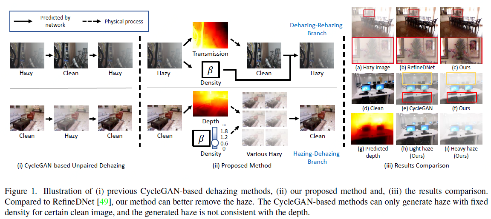
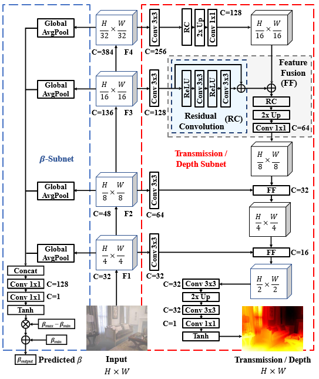

D4: Self-augmented Unpaired Image Dehazing via Density and Depth Decomposition
===============================================
This is the PyTorch implementation of the paper 'Self-augmented Unpaired Image Dehazing via Density and Depth Decomposition', which is accepted by CVPR2022. 

Introduction
---------------------------------
In this paper, we propose a self-augmented image dehazing framework, termed D4 (Dehazing via Decomposing transmission map into Density and Depth) for haze generation and removal. Instead of merely estimating transmission maps or clean content, the proposed framework focuses on exploring scattering coefficient and depth information contained in hazy and clean images. With estimated scene depth, our method is capable of re-rendering hazy images with different thicknesses which further benefits the training of the dehazing network.



Prerequisites
---------------------------------
* Python 3.7
* Pytorch 1.7.1
* NVIDIA GPU + CUDA cuDNN

Datasets
---------------------------------
### 1.Testing
We used [SOTS-indoor](https://sites.google.com/view/reside-dehaze-datasets/reside-v0), [SOTS-outdoor](https://sites.google.com/view/reside-dehaze-datasets/reside-v0)  and [I-HAZE](https://data.vision.ee.ethz.ch/cvl/ntire18//i-haze/) for testing.  

After downloading the dataset, please use scripts/flist.py to generate the file lists. For example, to generate the training set file list on the SOTS-indoor testset, you should run:

```
python scripts/flist.py --path path_to_SOTS_indoor_hazy_path --output ./datasets/sots_test_hazy_indoor.flist
```

And then fill the path of ground truth images in the config file.

Please notice that the ground truth images of SOTS-indoor have additional white border, you can crop it first.

### 2.Training 
For training, we used [ITS](https://sites.google.com/view/reside-dehaze-datasets/reside-standard) dataset, you can follow the operations above to generate the training file lists.

```
python scripts/flist.py --path ITS_train_hazy_path --output ./datasets/its_train_hazy.flist
python scripts/flist.py --path ITS_train_gt_path --output ./datasets/its_train_gt.flist
```

Getting Started
--------------------------------------
To use the pre-trained models, download it from the following link then copy it to the corresponding checkpoints folder, like `./checkpoints/quick_test`

[Pretrained model](https://drive.google.com/file/d/1KLvPdNpskdVDSz0qEIP_tn-j2MwTcJAV/view?usp=sharing)

### 0.Quick Testing
To hold a quick-testing of our dehazing model, download our pre-trained model and put it into `checkpoints/quick_test`, then run:
```
python3 test.py --model 1 --checkpoints ./checkpoints/quick_test
```
and check the results in 'checkpoints/quick_test/results'

If you want to see the depth estimation and haze generation results, change the `TEST_MODE` term from `pair_test` to `clean`, then run the same command.  

### 1.Training
1)Prepare the SOTS-indoor training datasets following the operations in the Dataset part.
2)Add a config file 'config.yml' in your checkpoints folder. We provide an example checkpoints folder and config file in `./checkpoints/train_example` 
3)Train the model, for example:

```
python train.py --model 1 --checkpoints ./checkpoints/train_example
```

### 2. Testing
1)Prepare the testing datasets following the operations in the Dataset part.
2)Put the trained weight in the checkpoint folder 
2)Add a config file 'config.yml' in your checkpoints folder. We provide an example checkpoints folder and config file in `./checkpoints/test_example`
3)Test the model, for example:
```
python test.py --model 1 --checkpoints ./checkpoints/test_example
```


Limitation
--------------------------------------
We found that our model is sensitive to training data. The training may be unstable on images that have a wide variation in depth. 

<!--
Update
--------------------------------------
We notice that in the supplmentary material we have uploaded the wrong version image of the network architecture, where the residual convolution part was wrongly illustrated. We put the correct version here to avoid misunderstanding. As mentioned in the supplementary material, the network architecture refers to Monocular relative depth perception with web stereo data supervision by Ke Xian et al.


-->


Citation
--------------------------------------
if you find our work useful, please cite:
```
@inproceedings{yang2022self,
  title={Self-Augmented Unpaired Image Dehazing via Density and Depth Decomposition},
  author={Yang, Yang and Wang, Chaoyue and Liu, Risheng and Zhang, Lin and Guo, Xiaojie and Tao, Dacheng},
  booktitle={Proceedings of the IEEE/CVF Conference on Computer Vision and Pattern Recognition},
  pages={2037--2046},
  year={2022}
}
```

